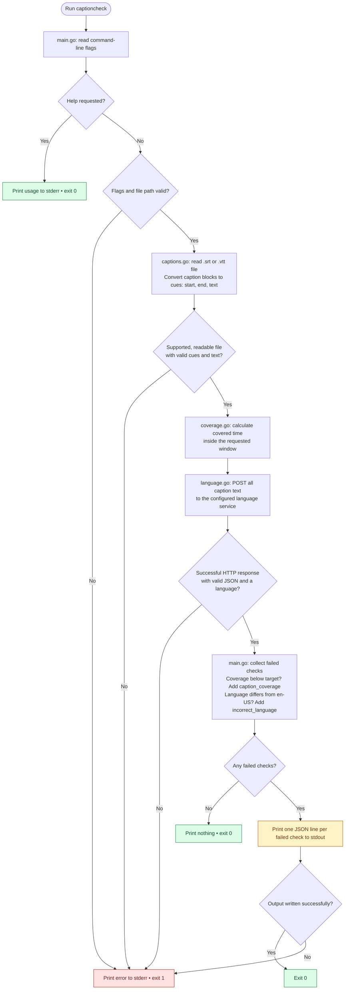
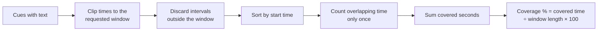

# How captioncheck works

Read the caption file, measure how long captions appear, ask the language service
what language the text uses, then report any failed checks. No video is read.

## Main flow

**A failed check still exits 0:** the program successfully determined that the
captions did not meet the requirements. **Exit 1** means it could not complete
the job, such as an unreadable file or an unavailable language service.

The language request happens even when coverage is too low. Results are printed
only after both checks complete; a service failure produces no partial report.
An output write failure can interrupt the report itself.

## How coverage is calculated

Example: within **0–10 seconds**, captions at **0–3** and **5–9** cover
**7 seconds**, or **70%**. A requirement of 80% fails. Two captions visible at the
same time do not count twice.

The coverage window limits the time calculation. The language service receives
text from the **whole file**, preserving file order.

## Where to look in the code

| File | Job |
| --- | --- |
| [main.go](main.go) | Organize the checks, output, and exit status |
| [captions.go](captions.go) | Turn SRT/WebVTT text into shared cue structs |
| [coverage.go](coverage.go) | Count covered time without double-counting overlaps |
| [language.go](language.go) | Send caption text and read the language response |

These diagrams use Mermaid and render directly when viewing this file on GitHub.
